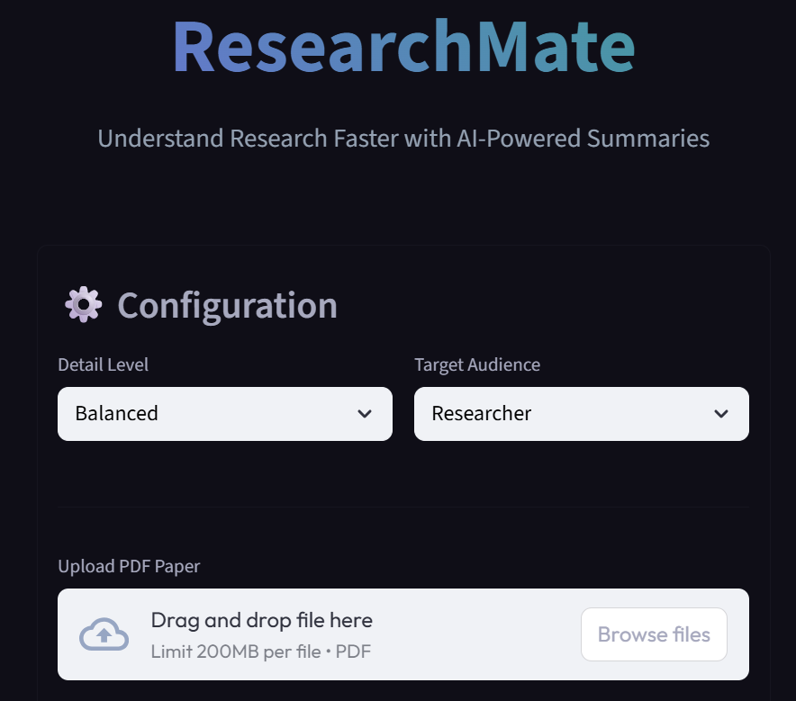
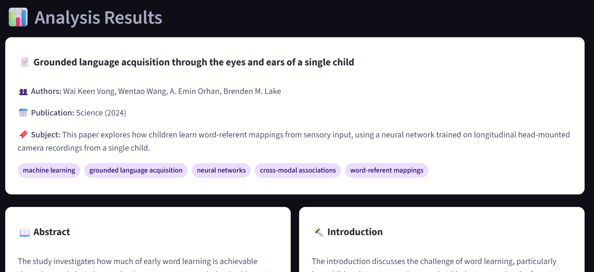

# 🧠 ResearchMate: AI-Powered Neuroscience Paper Summarizer


**ResearchMate** is a streamlined web application designed to accelerate academic research. By leveraging Google's **Gemini 2.0 Flash AI**, it processes complex scientific papers (PDFs) and extracts structured, actionable insights, allowing researchers to understand key findings in seconds rather than hours.

---

## Features

*   **Full PDF Analysis:** Extracts text directly from uploaded scientific papers.
*   **Context-Aware AI:** Uses a specialized prompt engineered for academic neuroscience research.
*   **Structured Summaries:** Automatically organizes content into:
    *   Abstract & Introduction
    *   Objectives & Hypotheses
    *   Methodology & Results
    *   Discussion & Limitations
    *   Key Conclusions
*   **Modern UI:** Features a dark-mode, glassmorphism-inspired interface for comfortable reading.
*   **Export Ready:** One-click download of the full analysis in Markdown format.

## Demo





## Tech Stack

*   **Frontend:** [Streamlit](https://streamlit.io/) (Python framework for data apps).
*   **AI Model:** [Google Gemini 2.0 Flash](https://deepmind.google/technologies/gemini/) via `google-genai` SDK.
*   **PDF Processing:** PyMuPDF (`fitz`).
*   **Environment Management:** `python-dotenv`.

## ⚙️ Installation & Setup

Follow these steps to run the project locally:

1.  **Clone the repository:**
    ```bash
    git clone https://github.com/YOUR-USERNAME/researchmate.git
    cd researchmate
    ```

2.  **Create a virtual environment (Optional but recommended):**
    ```bash
    python -m venv .venv
    # Windows
    .venv\Scripts\activate
    # Mac/Linux
    source .venv/bin/activate
    ```

3.  **Install dependencies:**
    ```bash
    pip install -r requirements.txt
    ```

4.  **Set up Environment Variables:**
    *   Create a `.env` file in the root directory.
    *   Add your Google Gemini API Key:
    ```text
    GEMINI_API_KEY=your_api_key_here
    ```

5.  **Run the application:**
    ```bash
    streamlit run main.py
    ```

## 🎯 Motivation

As a Neuroscience student, keeping up with the vast volume of literature is a challenge. I built **ResearchMate** to bridge the gap between complex data and quick comprehension, demonstrating how Python and Generative AI can be applied to solve real-world academic problems.

---

*Developed by Bianca [Your Last Name]*